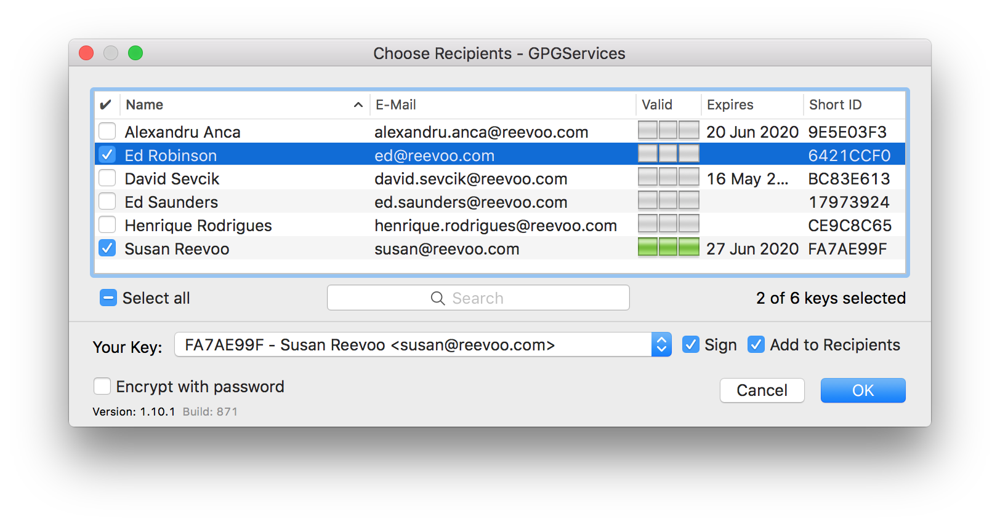

GNU Privacy Guard
=================


GNU Privacy Guard (GPG) is a complete and free implementation of the OpenPGP
standard. We use it at Reevoo in order to make it simple and secure to transfer
sensitive information between people on the team.

Sensitive information includes things like: Passwords, API keys, or customer data.

GPG also allows things like files or git commits to be signed to prove their
provenance.

## Policy

For now this only applies for communications within the Engineering team.

1. We use GPG Encryption whenever we need to send Passwords or other credentials to another person.
2. We use GPG Encryption whenever we need to transfer PII or other sensitive data to another person.
3. We sign all our Git commits with GPG as best practice.

## OSX

### Installation 

On OSX the simplest and best integrated way to get GPG is to install
[GPGtools](https://gpgtools.org/).

This can be done with the package available on the website. Or with
[Homebrew Cask](https://caskroom.github.io/)

```bash
brew tap caskroom/cask
brew cask install gpgtools
```

### Setup

Once you have installed gpg tools you will need to setup a private key and
make your public key available to other members of the team.

1. Open the GPG Keychain Application
  * Click on the New icon in the top left corner
2. Fill in your details
   

  * Choose a key length of `4096`
  * Make sure you use a paraphrase to protect your key
  * Click generate key.

3. Upload Your Key
   * Choose Preferences from the GPG Keychain Menu
   
   * Ensure that the keyserver is `hkps://hkps.pool.sks-keyservers.net` 
   (this should be the default)
   * `Right Click` > `Send public key to Keyserver`
   

4. Wait for your key to become available on the keyserver.
  * Go to lunch or something, it will take 10 - 15 mins.
  

5. Get someone else to verify your key.
  * Before you use GPG to send sensitive information you need to be sure
  you are encrypting it for the right person, and they need to be sure
  that the information they are receiving is really from you. GPG is
  designed to create a web of trust, so if someones key is signed by
  someone else on the team that you trust, you can skip this step.
  * First get a friend to download your public key. They can do this by
  clicking on the Lookup Key Button in GPGKeychain and searching by
  email address.
  * Then compare the keys fingerprint, you should do this in person,
  over Skype or the phone, so you can be sure you are not talking
  to an impostor.
  * If the fingerprints match ask your friend to sign your key.
  Right Click > Sign...
  
  * Then your friend can upload the signed version of your key.
    Right Click > Send public key to keyserver
  

### Usage

#### Encrypt Text

Often it is useful to encrypt a small amount of text, stuff like passwords etc.

* Select the text.
* Right Click > `Services` > 
  
* Choose Recipients
  
* Press `OK`
* You can then send the encrypted text using any method you wish: slack, email, etc

#### Decrypt Text

* Select the encrypted text.
* Right Click > `Services` > `Open PGP: Decrypt Selection to New Window`

#### Encrypt File

* Right click a file in Finder > `Services` > `Open PGP: Encrypt File`
* Choose Recipients
  
* Press `OK`
* You can then send the encrypted file using any method you wish: slack, email, etc

#### Decrypt File

* Right click a file in Finder > `Services` > `Open PGP: Decrypt File`

#### Sign Git Commits

You may want to sign your git commits with GPG, this is good practice so we can be sure that a particular person really was responsible for a particular commit.

* [Tell git about your private key](https://help.github.com/articles/telling-git-about-your-gpg-key/)
* [Sign your commits with GPG](https://help.github.com/articles/signing-commits-using-gpg/)
	* Add `-S` to the commit command: i.e. `git commit -S`
	* or run `git config --global commit.gpgsign true` to automatically sign every commit.
	* The first time you sign a commit you may need to enter the passphrase of your private key, but this can be stored in the OSX keychain if you are using GPGTools.
* 	[Add Your GPG key to your Github account](https://help.github.com/articles/adding-a-new-gpg-key-to-your-github-account/)
	* This will show your commits as verified in the Github interface.		